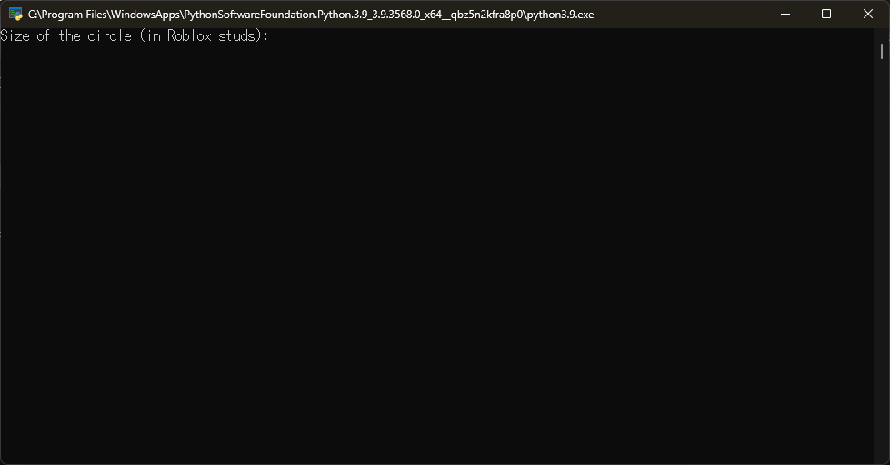
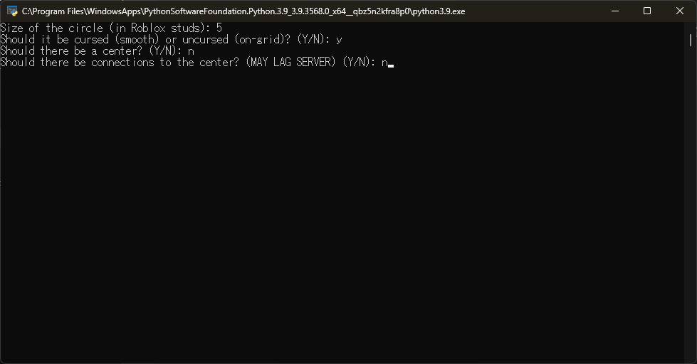
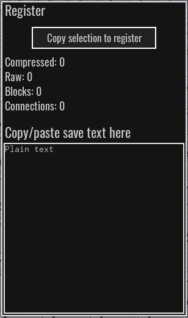
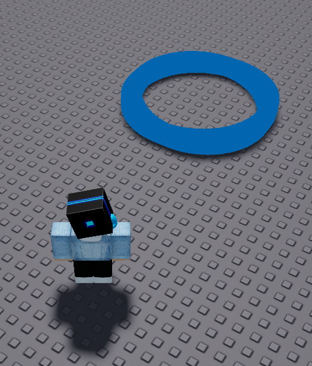

# Woohoo!

This is the 3rd Circuit Maker 2 tool coded in Python on my GitHub account! Anyways, you are reading this for the tutorial, right? ... alright lets do it

(Note: You need `Python 3.9` and `pip install cm2py`)

# Tutorial

1) Join a Circuit Maker 2 server.
   
2) Now open the tool. (yes i use ms store python)
   
3) Fill everything out in the program.
   
4) Press Enter, and the window should close, or the program should halt. That's good! The save text is now copied to your clipboard. Click this icon:
   
   and a menu should pop up:
   
5) Click the words "Plain text", and hold Ctrl and press V. Now, you have the save text in, BUT MAKE SURE TO PRESS ENTER. If the value of "Compressed", "Raw", "Blocks", or "Connections" changes, then you're good.
6) Now, click this icon:
   
   Then click somewhere on the map where you want your circle to be. And... ta-da!!
   

That is **it**! You completed the quest to show a *circle*! You can mess around with the settings. Updates will come soon! ^v^

# Bloopers

I'm sorry, I didn't catch any bloopers. The next Circuit Maker 2 tool I make will make up for it, again I'm *sorry*!

